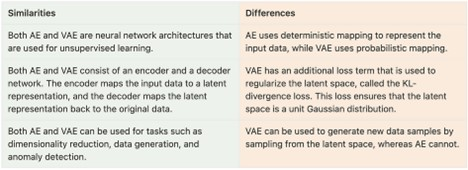
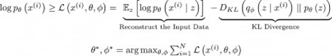

# **Variational Autoencoders (VAE) for MNIST Dataset**

  
  

Welcome to this project exploring **Variational Autoencoders (VAE)** on the **MNIST** dataset! 🚀

This repository demonstrates training VAEs with different latent sizes (2, 4, and 16) and showcases the impact of latent space dimensions through:

- **Reconstruction Performance**
- **Latent Space Visualizations**
- **Training Metrics**

---

## **Overview**

Variational Autoencoders (VAEs) extend traditional Autoencoders (AEs) by introducing a **probabilistic framework** to the latent space. This enhancement provides better generalization, continuity, and the ability to generate new data samples.

Key distinctions include:

### **Standard Autoencoder**
- Maps input data deterministically to a fixed latent representation.
- Lacks the ability to generate new samples or capture data variability.

### **Variational Autoencoder (VAE)**
- Models the latent space as a **probability distribution**, typically Gaussian.
- Enables sampling from the latent space for data generation.
- Includes a **KL Divergence** term in the loss to regularize the latent space.

Here is an illustrative comparison:

The following sections explore the VAE structure, its mathematical formulation, and experimental results on the MNIST dataset.

---

## **Core Concepts**

### **Latent Space in VAE**
In a standard AE, the encoder maps input data to a fixed latent vector. In contrast, VAE encodes inputs into a probabilistic distribution, allowing the latent space to:

1. **Encourage Continuity**: Similar inputs yield close latent encodings.
2. **Enable Sampling**: Random samples from the distribution generate diverse and realistic outputs.

Key advantages of this design:
- Smoother latent space.
- Improved generalization.
- Capability to generate new, meaningful data.

### **Mathematical Formulation**

The VAE loss combines two terms:

1. **Reconstruction Loss**
   Measures how accurately the model reconstructs the input data:

   \[
   \mathcal{L}_{Recon} = \text{MSE}(x, \hat{x})
   \]

   or Binary Cross-Entropy (BCE) for binary inputs:

   \[
   \mathcal{L}_{Recon} = -\mathbb{E}_{q(z|x)} \left[\log p(x|z)\right]
   \]

2. **KL Divergence Loss**
   Regularizes the latent space by enforcing similarity between the learned distribution \( q(z|x) \) and a standard Gaussian prior \( p(z) \):

   \[
   \mathcal{L}_{KL} = D_{KL}\left(q(z|x) \parallel p(z)\right)
   \]

   KL Divergence is given by:

   \[
   D_{KL}(P \parallel Q) = \sum P(x) \log\left(\frac{P(x)}{Q(x)}\right)
   \]

The total VAE loss is:

\[
\mathcal{L}_{VAE} = \mathcal{L}_{Recon} + \beta \cdot \mathcal{L}_{KL}
\]

Where \( \beta \) controls the weight of the KL term.

---

## **Model Architecture**

### **Encoder**
Maps input images \( x \) to a latent distribution \( q(z|x) \) characterized by:
- Mean (\( \mu \))
- Variance (\( \sigma^2 \))

### **Latent Sampling**
To enable backpropagation through the probabilistic latent space, VAE employs the **reparameterization trick**:

\[
 z = \mu + \sigma \cdot \epsilon, \quad \epsilon \sim \mathcal{N}(0, 1)
\]

### **Decoder**
Generates reconstructions \( \hat{x} \) from sampled latent vectors \( z \).

---

## **Experimental Results**

### **Latent Space Visualization**
Below are the latent space visualizations for different latent sizes. The GIFs illustrate how the latent space evolves during training.

<table>
  <tr>
    <th>Latent Size</th>
    <th>Latent 2</th>
    <th>Latent 4</th>
    <th>Latent 16</th>
  </tr>
  <tr>
    <td>Latent Space Visualization</td>
    <td></td>
    <td></td>
    <td></td>
  </tr>
</table>

### **Reconstruction Results**

Sample reconstructions of test images at various latent sizes:

<table>
  <tr>
    <th>Latent Size</th>
    <th>Reconstruction GIF</th>
  </tr>
  <tr>
    <td align="center">2</td>
    <td></td>
  </tr>
  <tr>
    <td align="center">4</td>
    <td></td>
  </tr>
  <tr>
    <td align="center">16</td>
    <td></td>
  </tr>
</table>

---

## **Metrics Tracking**

Training metrics, including **MSE**, **SSIM**, and **PSNR**, were tracked for train and test sets. Here are the plots for each latent size:

### Latent Size: 2

### Latent Size: 4

### Latent Size: 16

---

## **References and Credits**

1. **Images and Concepts**: Thanks to authors and resources such as [source 1](#) and [source 2](#) for providing visualizations.
2. **Math Formulas**: KL Divergence explanations were adapted from authoritative ML texts.

---

### 🚀 Happy Experimenting!

