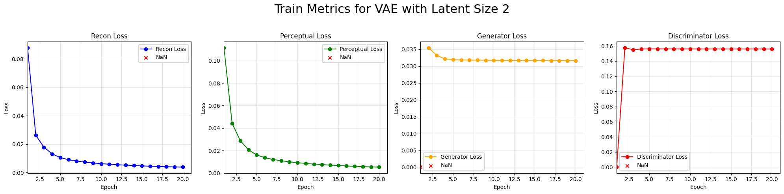
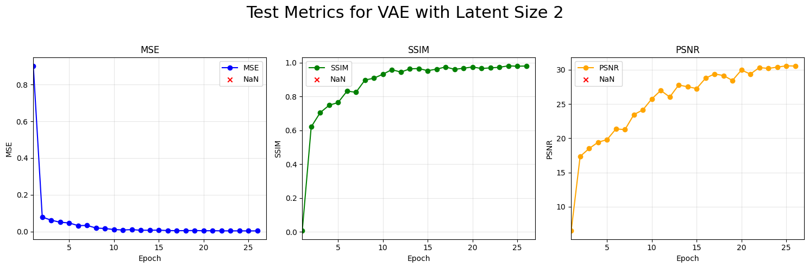
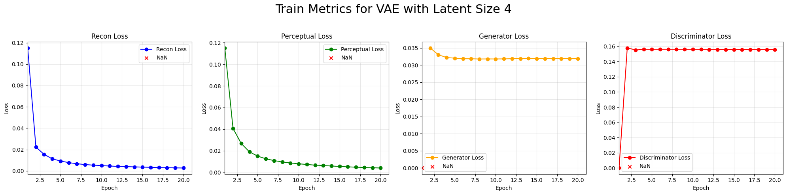
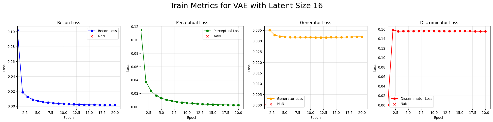
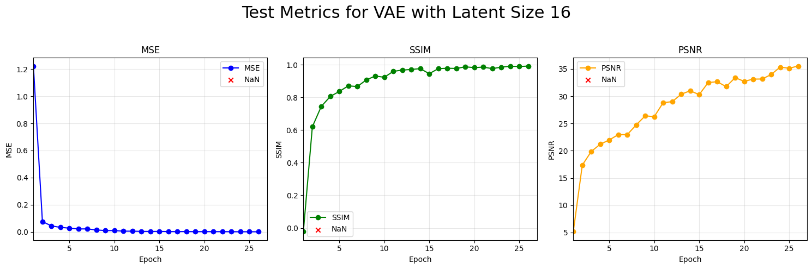
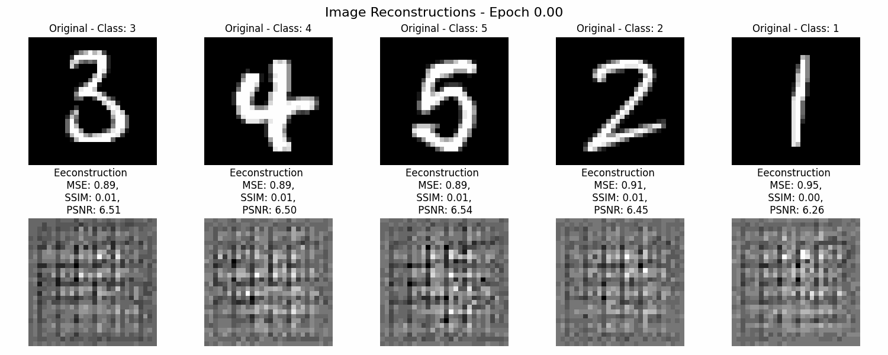
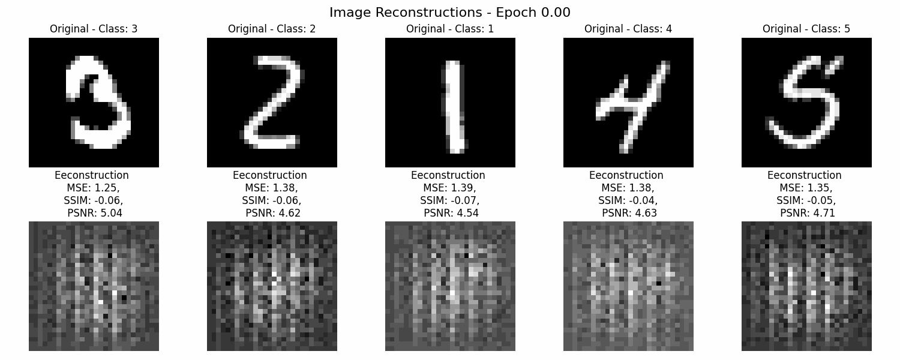
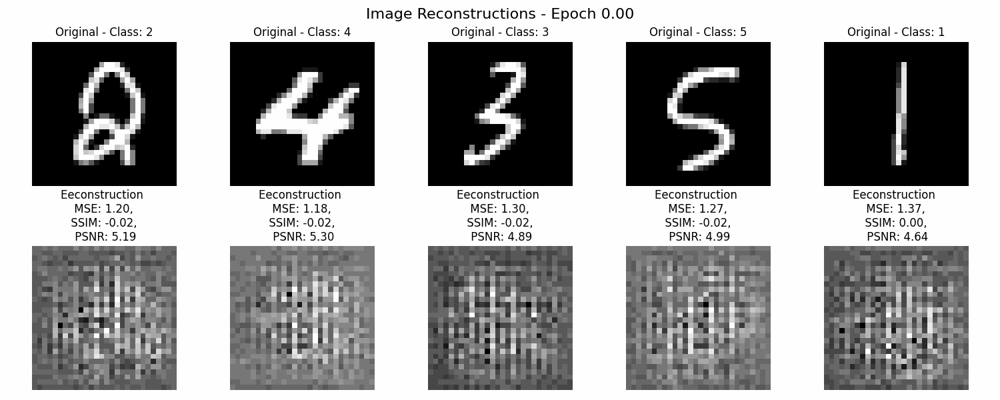

# **Variational Autoencoders (VAE) for MNIST Dataset**

Welcome to this project exploring **Variational Autoencoders (VAE)** on the **MNIST** dataset! 🚀

This repository demonstrates training VAEs with different latent sizes (2, 4, and 16) and showcases the impact of latent space dimensions through:

- **Reconstruction Performance**
- **Latent Space Visualizations**
- **Training Metrics**

---

## **Overview**

This project investigates how the size of the latent space in VAEs affects image reconstruction quality and latent space structure. For each latent size, metrics like **MSE**, **SSIM**, and **PSNR** are tracked, along with visualizations of reconstructions and latent spaces.

---

## **Key Features**

1. **Latent Space Visualization**
    - Explore the structure of latent spaces for various latent sizes.
2. **Reconstruction Comparison**
    - Compare original and reconstructed images at different latent sizes.
3. **Metrics Tracking**
    - Analyze MSE, SSIM, and PSNR during training.
4. **Dynamic GIFs**
    - Animated visualizations of reconstruction and latent space evolution.

---

## **Training plots**

Metrics such as **MSE**, **SSIM**, and **PSNR** were tracked during training for both train and test sets. Below are the results for different latent sizes.

#### **Latent Size: 2**

#### **Latent Size: 4**

#### **Latent Size: 16**

---

## **Results and Visualizations**

### 1. **Sample Reconstructions**

Below are reconstructions of test images (samples 1–5) at various latent sizes. The GIFs capture reconstruction evolution during training.

<table>
  <tr>
    <td align="center"><strong>Latent Size: 2</strong></td>
    <td></td>
  </tr>
  <tr>
    <td align="center"><strong>Latent Size: 4</strong></td>
    <td></td>
  </tr>
  <tr>
    <td align="center"><strong>Latent Size: 16</strong></td>
    <td></td>
  </tr>
</table>

---
### 2. **Latent Space Visualizations**

These visualizations highlight how the latent space evolves with different latent sizes. Each GIF shows the latent space for the test set during training.

<table>
  <tr>
    <th>Latent Size</th>
    <th>Latent Space Visualization</th>
  </tr>
  <tr>
    <td align="center">2</td>
    <td></td>
  </tr>
  <tr>
    <td align="center">4</td>
    <td></td>
  </tr>
  <tr>
    <td align="center">16</td>
    <td></td>
  </tr>
</table>

---

## **Technical Details**

### Variational Autoencoder (VAE)

The VAE consists of:
- **Encoder**: Maps input images to a latent distribution.
- **Decoder**: Reconstructs images from the latent distribution.

### Loss Function

The VAE loss combines **reconstruction loss** and **KL divergence**:

\[ \mathcal{L}_{VAE} = \mathcal{L}_{Recon} + \beta \cdot \mathcal{L}_{KL} \]

Where:
- \( \mathcal{L}_{Recon} \): Mean Squared Error (MSE) between original and reconstructed images.
- \( \mathcal{L}_{KL} \): KL divergence between latent distribution and a standard Gaussian.
- \( \beta \): Weight for the KL term.

### Metrics

1. **MSE (Mean Squared Error)**
2. **SSIM (Structural Similarity Index)**
3. **PSNR (Peak Signal-to-Noise Ratio)**

---

## **Future Directions**

- 🧱 Experiment with higher latent sizes.
- 🔄 Apply the method to complex datasets like CIFAR-10.
- 📈 Improve reconstruction quality using perceptual losses.

---

### 🚀 Happy Experimenting!

