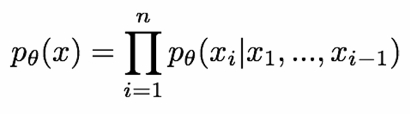
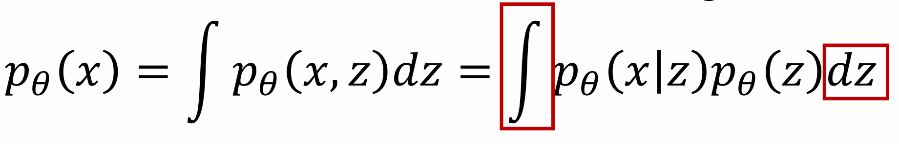
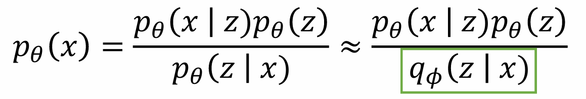
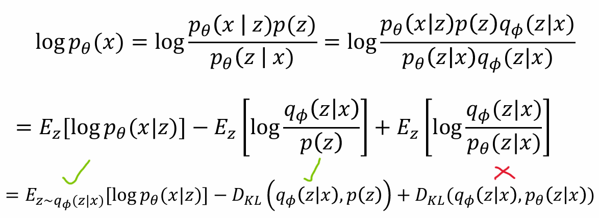
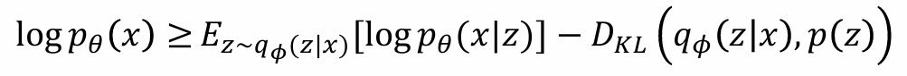
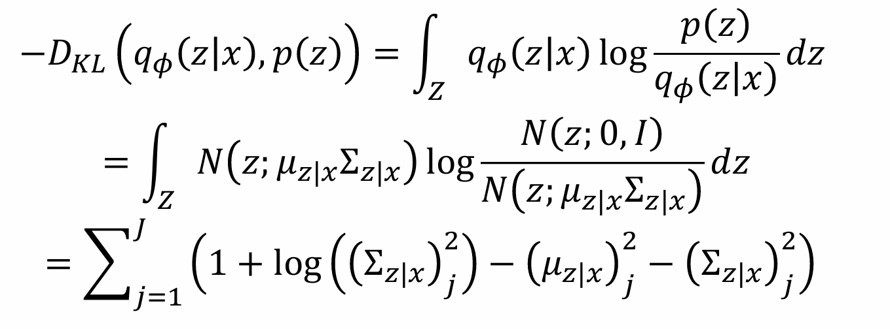
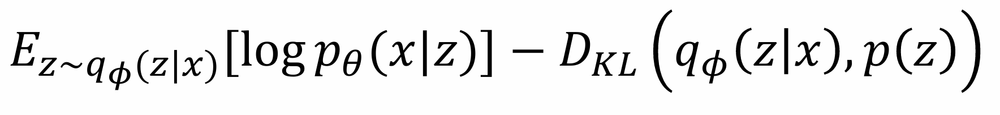

# **Variational Autoencoders (VAE) for MNIST Dataset**

  
  

Welcome to this project exploring **Variational Autoencoders (VAE)** on the **MNIST** dataset! 🚀

This repository demonstrates training VAEs with different latent sizes (2, 4, and 16) and showcases the impact of latent space dimensions through:

- **Reconstruction Performance**
- **Latent Space Visualizations**
- **Training Metrics**

---

## **Overview**

Variational Autoencoders (VAEs) extend traditional Autoencoders (AEs) by introducing a **probabilistic framework** to the latent space. This enhancement provides better generalization, continuity, and the ability to generate new data samples.

### **Key Differences: Standard AE vs VAE**

| Feature                          | **Standard Autoencoder (AE)**                                     | **Variational Autoencoder (VAE)**                            |
|----------------------------------|-------------------------------------------------------------------|-------------------------------------------------------------|
| **Mapping Type**                 | Deterministic: Encodes data to a fixed latent representation.     | Probabilistic: Encodes data into a latent distribution (mean and variance). |
| **Sampling**                     | No Sampling: Reconstructs outputs directly from deterministic encodings. | Supports Sampling: Enables generation of new data points by sampling from the latent space. |
| **Latent Space Regularization**  | None: Focuses on reconstruction accuracy only.                   | Uses **KL Divergence** to enforce smoothness and continuity in the latent space. |
| **Generative Capabilities**      | Limited: Cannot generate new data samples.                       | Powerful: Can generate diverse and realistic data samples. |
| **Focus**                        | Solely on reconstruction of input data.                          | Balances reconstruction and latent space organization for generative tasks. |

### **Why Probabilistic Latent Space?**

1. **Data Generation**: Sampling from a latent distribution allows VAEs to generate diverse outputs that resemble the training data.
2. **Continuity**: Nearby points in the latent space correspond to similar outputs, ensuring smooth transitions in generated data.
3. **Regularization**: The additional KL divergence term ensures the learned latent distribution aligns with a standard Gaussian, making the space interpretable and well-structured.

---

## **Core Concepts**

### **Mathematical Framework**

1. **Maximizing Data Likelihood**  
   The primary goal of a Variational Autoencoder is to maximize the likelihood of the observed data p(x). This is expressed as:

   
   

   However, solving this integral is **intractable** because integrating over all possible \( z \) is computationally expensive.

---

2. **Bayes' Rule Approximation**  
   To address this, Bayes' rule is applied:
   

   But there’s a new problem: computing p_theta(z|x) is still challenging because it involves knowledge of the posterior, which is also intractable.

---

3. **Neural Network as an Estimator**  
   To approximate p_theta(z|x), we use a neural network q_phi(z|x) to act as the posterior. This is referred to as the variational posterior and makes the computation feasible.
   

   Now, instead of directly computing the likelihood p(x), the focus shifts to maximizing a lower bound called the **Evidence Lower Bound (ELBO)**.

---

4. **Decomposing the ELBO**  
   Using the new approximation, the logarithm of p(x) can be rewritten as:

   
   
   Here:
   - **ELBO**: Evidence Lower Bound, which we aim to maximize during training.
   - D_KL: Kullback-Leibler divergence between q_phi(z|x) and the true posterior p_theta(z|x).

   Since D_KL >= 0, maximizing the ELBO brings us closer to the true log-likelihood p(x).

---
5. **KL Divergence Loss**

The **Kullback-Leibler (KL) Divergence** measures the difference between the learned latent distribution q_phi(z|x) (produced by the encoder) and the prior distribution p(z) (usually a standard Gaussian N(0, 1):

   

This is a statistical measure to ensure the generated latent space distribution aligns closely with the desired prior distribution.

### **Why is KL Divergence Important?**

1. **Latent Space Regularization**: Ensures that the latent space is smooth, continuous, and well-organized, making it easier to sample meaningful latent vectors.
2. **Avoiding Overfitting**: Without the KL term, the latent space may overfit the training data, losing generalization to new, unseen inputs.
3. **Generative Capabilities**: A structured latent space ensures that new samples generated from the prior distribution resemble the training data.

By enforcing this regularization, KL divergence encourages the model to learn a meaningful and generative latent space.

---

6. **Final Loss Function**  
   Combining these, the VAE goal is to maximizing the lower bound:

   

   Where the first term encourages accurate reconstruction of input data and the second term regularizes the latent space to align with a standard Gaussian prior.

#### **Acknowledgments** 

The mathematical explanations and formula illustrations in this section were adapted from [Justin Johnson's EECS 498-007: Deep Learning for Computer Vision](https://web.eecs.umich.edu/~justincj/teaching/eecs498/FA2020/). Credit goes to the original author for the insightful material and visualizations.
---

### **Encoder and Decoder Roles**

1. **Encoder**:
   - Maps input data \(x\) to a latent distribution characterized by:
     - Mean (\(\mu\)) 
     - Variance (\(\sigma^2\))
   - Outputs the parameters for sampling latent representations \(z \sim \mathcal{N}(\mu, \sigma^2)\).

2. **Decoder**:
   - Maps sampled latent vectors \(z\) back to the data space.
   - Outputs the reconstructed data \(\hat{x}\).

---

### **Sampling with Reparameterization Trick**

Since direct backpropagation through stochastic sampling is not feasible, VAEs employ the **reparameterization trick**:

\[
z = \mu + \sigma \cdot \epsilon
\]

Where \(\epsilon \sim \mathcal{N}(0, 1)\) is a random noise vector. This enables gradient-based optimization while allowing latent space sampling.

---

## **Model Architecture**

### **Encoder**
Maps input images \( x \) to a latent distribution \( q(z|x) \) characterized by:
- Mean (\( \mu \))
- Variance (\( \sigma^2 \))

### **Latent Sampling**
To enable backpropagation through the probabilistic latent space, VAE employs the **reparameterization trick**:

\[
 z = \mu + \sigma \cdot \epsilon, \quad \epsilon \sim \mathcal{N}(0, 1)
\]

### **Decoder**
Generates reconstructions \( \hat{x} \) from sampled latent vectors \( z \).

---

## **Experimental Results**

### **Latent Space Visualization**
Below are the latent space visualizations for different latent sizes. The GIFs illustrate how the latent space evolves during training.

<table>
  <tr>
    <th>Latent Size</th>
    <th>Latent 2</th>
    <th>Latent 4</th>
    <th>Latent 16</th>
  </tr>
  <tr>
    <td>Latent Space Visualization</td>
    <td></td>
    <td></td>
    <td></td>
  </tr>
</table>

### **Reconstruction Results**

Sample reconstructions of test images at various latent sizes:

<table>
  <tr>
    <th>Latent Size</th>
    <th>Reconstruction GIF</th>
  </tr>
  <tr>
    <td align="center">2</td>
    <td></td>
  </tr>
  <tr>
    <td align="center">4</td>
    <td></td>
  </tr>
  <tr>
    <td align="center">16</td>
    <td></td>
  </tr>
</table>

---

## **Metrics Tracking**

Training metrics, including **MSE**, **SSIM**, and **PSNR**, were tracked for train and test sets. Here are the plots for each latent size:

### Latent Size: 2

### Latent Size: 4

### Latent Size: 16

---

## **References and Credits**

1. **Images and Concepts**: Thanks to authors and resources such as [source 1](#) and [source 2](#) for providing visualizations.
2. **Math Formulas**: KL Divergence explanations were adapted from authoritative ML texts.

---

### 🚀 Happy Experimenting!

